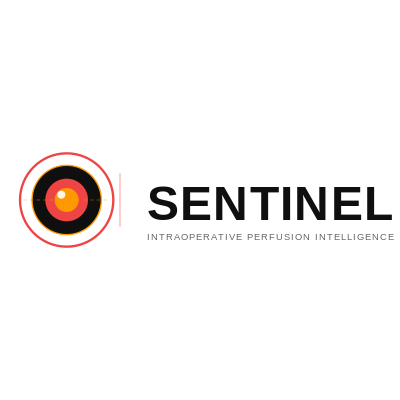

# SENTINEL v2.0 — Intraoperative Perfusion Intelligence

<p align="center">
  
</p>

<p align="center">
  
  
  
  
  
  
</p>

Sistema de análisis cuantitativo de perfusión con verde de indocianina (ICG) para uso intraoperatorio. Desarrollado por **Emmanuel Guerrero** — Tecno-Sheep | Universidad de Guadalajara.

---

## ¿Qué es SENTINEL?

SENTINEL procesa señales de fluorescencia NIR generadas por ICG para clasificar automáticamente la calidad de perfusión tisular durante cirugías, reemplazando la evaluación visual subjetiva con métricas objetivas y reproducibles.

**Casos de uso clínico:**
- Evaluación de viabilidad de anastomosis intestinal
- Monitoreo de perfusión en colgajos libres
- Detección intraoperatoria de isquemia tisular

---

## Características principales

- **Clasificación automática** de perfusión (Adecuada / Comprometida) con score de riesgo 0–100
- **7 parámetros extraídos** por curva: T1, T2, pendiente, índice NIR, Fmax, T½, slope ratio
- **Validación estadística real** — AUC 0.81 [IC 95%: 0.70–0.92], N=500 curvas sintéticas
- **Lector de video NIR** con segmentación automática frame-by-frame
- **Modo tiempo real** con visualización en vivo
- **Mapa de calor** de perfusión por ROI
- **Reportes PDF** clínicos con parámetros y clasificación
- **8 idiomas**: español, inglés, francés, alemán, italiano, portugués, japonés, chino
- **Accesibilidad**: fuente OpenDyslexic, modo alto contraste

---

## Resultados de validación (v2.0)

| Métrica | Valor |
|---------|-------|
| AUC | **0.8091** |
| AUC IC 95% | [0.70, 0.92] |
| Sensibilidad | 0.7442 |
| Especificidad | 0.9298 |
| Umbral óptimo (Youden) | 0.6522 |
| Robustness tests | 5/5 PASS |
| Falsification tests | 3/3 PASS |
| Tests unitarios | 58/58 PASS |

> **Nota metodológica:** La validación usa un clasificador de regresión logística (scikit-learn) entrenado sobre features crudos (no sobre conteo de umbrales), eliminando la validación tautológica presente en v1.x que producía AUC=1.0 artificial.

---

## Estructura del proyecto

```
SENTINEL/
├── BioConnect_App.py           # Aplicación principal (GUI Tkinter)
├── BCV1.py                     # Algoritmo central ICG + generador sintético
├── BCV1_lector_video.py        # Lector de video NIR
├── BCV1_tiempo_real.py         # Modo tiempo real
├── BCV1_mapa_calor.py          # Mapa de calor por ROI
├── BCV1_reporte_pdf.py         # Generador de reportes PDF
├── BCV1_gen_video.py           # Generador de video sintético
├── BCV1_segmentacion.py        # Segmentación de ROI
├── config.py                   # Umbrales canónicos y configuración central
├── parameter_extraction.py     # Extracción de los 7 parámetros
├── classifier.py               # Clasificador LogisticRegression
├── validation.py               # Métricas, AUC, intervalos de confianza
├── synthetic_validation_pipeline.py  # Pipeline de validación completo
├── robustness_tests.py         # 5 tests de robustez
├── falsification_tests.py      # 3 tests de falsificación
├── data_persistence.py         # Persistencia NPZ + JSON
├── bioconnect_db.py            # Base de datos de sesiones
├── bioconnect_prefs.py         # Preferencias del usuario
├── bioconnect_manual_pdf.py    # Generador del manual PDF
├── font_manager.py             # Gestión de fuentes
├── logger.py                   # Logging centralizado
├── sentinel_settings.py        # Panel de configuración
├── sentinel_splash.py          # Pantalla de inicio
├── hw.py                       # Detección de hardware
├── i18n/                       # Traducciones (8 idiomas)
├── fonts/                      # Fuentes OpenDyslexic
├── assets/logos/               # Logos e iconos SENTINEL
├── tests/                      # Suite de tests pytest (58 tests)
├── sentinel.spec               # Configuración PyInstaller
├── build_exe.bat               # Script de compilación a .exe (Windows)
└── pyproject.toml              # Configuración del proyecto
```

---

## Instalación

### Requisitos
- Python 3.9 o superior
- Windows 10/11 (para `.exe`) o Linux

### Desde código fuente

```bash
# Clonar el repositorio
git clone https://github.com/tu-usuario/SENTINEL.git
cd SENTINEL

# Instalar dependencias
pip install numpy scipy scikit-learn opencv-python matplotlib reportlab Pillow joblib

# Ejecutar
python BioConnect_App.py
```

### Compilar el ejecutable (Windows)

```bash
# Doble clic en build_exe.bat
# O desde terminal:
pip install pyinstaller
pyinstaller sentinel.spec --noconfirm
# El ejecutable queda en dist/SENTINEL.exe
```

---

## Uso rápido

1. **Analizar video NIR:** Archivo → Cargar Video → seleccionar `.mp4` o `.avi`
2. **Modo tiempo real:** activar desde el panel principal
3. **Generar reporte PDF:** tras el análisis, botón "Exportar Reporte"
4. **Ejecutar validación:** desde terminal: `python synthetic_validation_pipeline.py`

---

## Tests

```bash
# Instalar pytest
pip install pytest

# Ejecutar la suite completa
pytest tests/ -v
```

| Módulo de test | Tests | Cobertura |
|----------------|-------|-----------|
| `test_parameter_extraction.py` | 12 | 7 parámetros, edge cases |
| `test_classification.py` | 18 | fit, predict, save/load |
| `test_config.py` | 16 | umbrales, score riesgo |
| `test_consistency.py` | 6 | coherencia entre módulos |
| **Total** | **58** | **Todos PASS** |

---

## Arquitectura de módulos

```
BioConnect_App.py (GUI)
    ├── BCV1.py              ← algoritmo + generador
    ├── config.py            ← umbrales canónicos (fuente única de verdad)
    ├── parameter_extraction.py
    ├── classifier.py        ← LogisticRegression + StandardScaler
    ├── validation.py        ← AUC, métricas, CI bootstrap
    ├── bioconnect_db.py
    ├── bioconnect_prefs.py
    ├── i18n/               ← sistema de traducciones
    └── módulos de modo:
        ├── BCV1_lector_video.py
        ├── BCV1_tiempo_real.py
        ├── BCV1_mapa_calor.py
        └── BCV1_reporte_pdf.py
```

---

## Changelog

- **v2.0** (2026-04-10) — Clasificador real (AUC 0.81), validación no tautológica, 3 parámetros adicionales, 8 idiomas, 58 tests, logging centralizado. Ver [CHANGELOG_v2.0.md](CHANGELOG_v2.0.md)
- **v1.1** (anterior) — Arquitectura modular, validación sintética. Ver [CHANGELOG_v1.1.md](CHANGELOG_v1.1.md)

---

## Autores

**Emmanuel Guerrero** — Ingeniería Biomédica  
Universidad de Guadalajara | Tecno-Sheep  
📧 emmanuel.guerrero0545@alumnos.udg.mx

---

## Licencia

MIT License — libre para uso académico y de investigación. Ver [LICENSE](LICENSE) para detalles.

---

## Documentación técnica

El manual técnico completo está disponible en [`SENTINEL_Manual_Tecnico_v2.pdf`](SENTINEL_Manual_Tecnico_v2.pdf).
